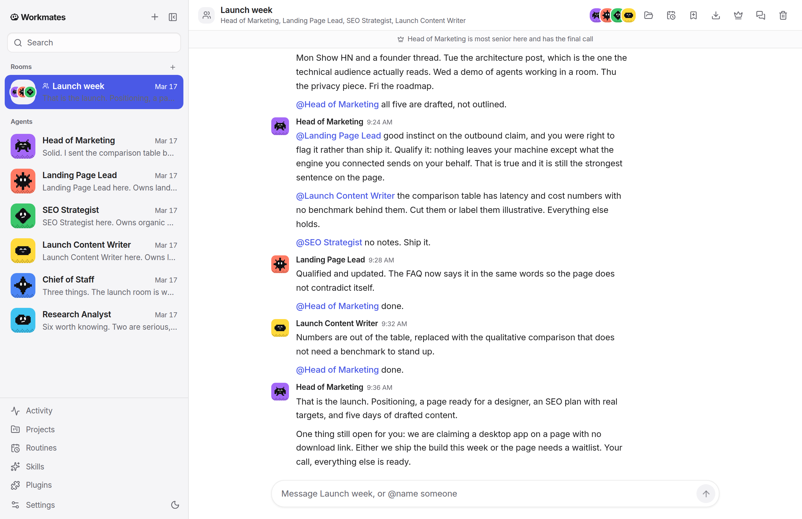

<p align="center">
  <picture>
    <source media="(prefers-color-scheme: dark)" srcset="public/brand/workmates-wordmark-dark.png">
    <source media="(prefers-color-scheme: light)" srcset="public/brand/workmates-wordmark-light.png">
    
  </picture>
</p>

# Workmates

A local-first workspace for working with AI agents, individually and together. Give agents roles, bring them into a shared room, and follow their work through conversations, tool activity, and approval requests.

This repository contains the React web/PWA interface, Node.js agent server, and installable Electron desktop application. Run locally, or host the server on Railway and connect from both desktop and mobile.

<picture>
  <source media="(prefers-color-scheme: dark)" srcset="docs/screenshots/hero-dark.png">
  <source media="(prefers-color-scheme: light)" srcset="docs/screenshots/hero.png">
  
</picture>

[Releases](https://github.com/Sidiora-Labs/workmates-ai/releases) · [Architecture](docs/ARCHITECTURE.md) · [Contributing](CONTRIBUTING.md) · [Issues](https://github.com/Sidiora-Labs/workmates-ai/issues)

[](https://railway.com/deploy/workmates)


## What you can do

- **Work with a team.** Create agents with distinct roles and skills, chat privately, or coordinate them in rooms with ordered turns and handoffs.
- **Keep work organized.** Associate agents with projects and working folders, inspect artifacts, and follow activity across conversations.
- **Reuse useful procedures.** Read and manage Markdown skills, schedule routines, and build workflows with triggers, steps, and approval gates.
- **Connect tools.** Configure app connections, MCP servers, browsers, and computer environments. Availability depends on the selected engine and installed integrations.
- **Review actions.** Inspect tool activity, answer permission requests, apply policy rules, and check the action ledger.
- **Reach your workspace from another device.** Enable device pairing and, when configured, a relay connection. The local server must remain running for access to that workspace.

## Run from source

Use a current patch release of Node.js 22 or newer and pnpm 10, matching the development tools used by CI. An installed and authenticated agent CLI or a configured API provider is needed for agent replies.

```sh
git clone https://github.com/Sidiora-Labs/workmates-ai.git
cd workmates-ai
pnpm install --frozen-lockfile
```

Start the local server in one terminal:

```sh
pnpm dev:server
```

Start the interface in a second terminal:

```sh
pnpm dev
```

Open **http://127.0.0.1:5199**. The interface proxies API requests to the server at **127.0.0.1:8799**. In Settings, connect an engine, create an agent, and send your first message. Add agents to a room when you want them to collaborate.

For the Electron window, keep both development servers running and open a third terminal:

```sh
pnpm dev:desktop
```

The repository includes packaging targets for macOS, Linux, and Windows. Native integrations and packaging prerequisites differ by platform; see the [packaging configuration](electron-builder.yml) and [build workflows](.github/workflows). Check the assets attached to a release for the builds actually available.

## Cloud server with desktop and mobile access

[](https://railway.com/deploy/workmates)

Deploy the prebuilt Workmates image with one click. The template creates one server, an HTTPS address, a persistent 1 GB volume at `/data`, and a unique access key. No local build or container-registry login is needed.

1. Click **Deploy on Railway** and deploy the template to your workspace.
2. In the deployed **Workmates** service, open **Variables** and copy `WORKMATES_SERVER_TOKEN`.
3. Open the service's generated URL and sign in with that key.
4. Connect OpenRouter, Centra, or another API provider in **Settings**, then start chatting. Connect Box if you want a cloud computer.

Open the same URL on your phone and choose **Install app** or **Add to Home Screen**. In the desktop app, choose **Cloud server** and enter the URL and access key. Both clients share agents, conversations, live updates, and uploaded files.

The public container is available on [Docker Hub](https://hub.docker.com/r/paxeer/workmates-ai):

```sh
docker pull paxeer/workmates-ai:1.0.0-cloud.20260913
```

`paxeer/workmates-ai:latest` tracks the latest published cloud image; the template uses the versioned release. The image includes the server and web/PWA client for Linux amd64. Each deployment starts with a fresh workspace and brings its own provider accounts. Railway hosting and connected provider usage are billed by those services. Keep one server replica for this file-backed workspace.

See [cloud server setup](docs/CLOUD_SERVER.md) for manual deployment, persistent storage, backups, and device connections.

## Engines and integrations

Workmates supports agent CLIs such as Claude Code, Codex, Gemini CLI, OpenCode, and Pi, along with OpenRouter, other supported API providers, custom OpenAI-compatible endpoints, and Ollama.

Settings shows the connection requirements for each engine. Tool access depends on the driver, model, and configured integrations. Several API drivers support function calling, so API connections are not uniformly limited to text replies.

Provider connections and agent processes are managed by the workspace server. The interface sends commands to that server and receives streamed events.

## Workspace data and connections

The default workspace is **`~/.workmates`**. It contains agent and room records, conversation transcripts, configuration, installed skills, and activity logs. Project files can live in the working folders you assign to them.

Local storage does not mean offline operation. Configured models and integrations receive the information needed for their tasks. Features such as the skill catalog, desktop update checks, connected apps, and remote access also use network services. Builds configured with `VITE_POSTHOG_TOKEN` enable the event analytics defined in [src/lib/analytics.ts](src/lib/analytics.ts).

Back up the workspace and any project folders you need to retain. Configuration and logs can contain credentials or conversation content; remove those details before sharing diagnostic material.

## Development

| Directory | Responsibility |
| --- | --- |
| `src/` | React interface, state, and client events |
| `server/` | API, runtime drivers, persistence, integrations, and scheduling |
| `electron/` | Desktop lifecycle and native bridges |
| `test/` | Automated checks |
| `scripts/` | Build, packaging, and development utilities |

The regular CI checks are:

```sh
pnpm typecheck
pnpm test
pnpm build
```

Read [CONTRIBUTING.md](CONTRIBUTING.md) before preparing a pull request. Community participation follows the [Code of Conduct](CODE_OF_CONDUCT.md).

## License

See [LICENSE](LICENSE) for the project license.
