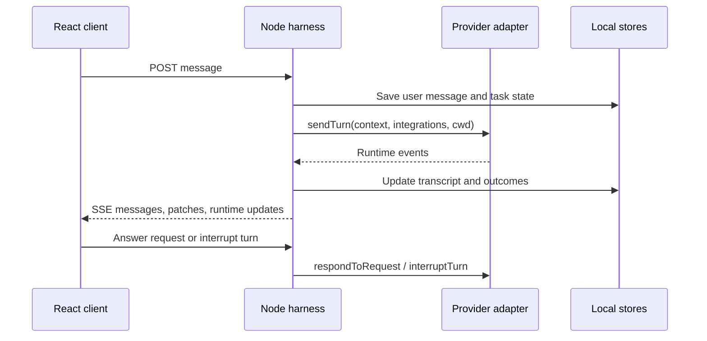

# Workmates architecture

Workmates is a local-first desktop workspace for personal AI agents. A shared React client presents conversations and work in Electron or a browser/PWA. A Node.js harness owns execution and saved state, and Electron supplies desktop integration. Provider accounts, optional computers, and remote access extend that local workspace.

## Source map

| Area | Entry points | Responsibility |
| --- | --- | --- |
| Client | [App](../src/App.tsx), [store](../src/state/store.tsx), [reducer](../src/state/reducer.ts) | Navigation, commands, transcript rendering, live state |
| Harness | [server](../server/index.ts), [contracts](../server/core/contracts.ts) | HTTP routes, turn orchestration, runtime events |
| Engines | [registry](../server/harness/registry.ts), [built-in drivers](../server/drivers/builtIn.ts) | Configured provider instances and execution adapters |
| Workspace | [stores](../server/stores/), [agent workspace](../server/agents/workspace.ts) | Agents, task lanes, rooms, files, memory, automations |
| Desktop | [main process](../electron/main.mjs), [preload](../electron/preload.cjs) | Windows, native services, packaged server lifecycle |
| Remote access | [pairing](../server/remote/pairing.ts), [relay link](../server/remote/relay-link.ts) | Optional paired-device access to the local harness |

## Client and turn lifecycle

The React client sends commands to the harness through HTTP. Provider connections and child processes belong to server-side adapters. `StoreProvider` wraps reducer actions with API calls and receives updates through one `/api/events` server-sent event stream.

On an initial connection, the stream's `hello` frame triggers hydration from `/api/bots`, `/api/rooms`, `/api/instances`, `/api/providers`, and `/api/config`. Frames carry sequence numbers. A reconnect requests `since`; the server can replay its bounded in-memory ring or tell the client to hydrate again. Screen frames are excluded from that ring.

`startTurn` selects an agent's task lane and provider instance, checks availability and busy state, and builds the turn input. Context includes the agent profile, selected skills, workspace memory, user profile, house style, deliverable location, and relevant conversation. Direct conversations use a budgeted transcript with stored compaction summaries. Quoted replies explicitly include the referenced author and excerpt.

Working-directory selection accounts for rooms, pinned task folders, agent settings, projects, and the agent's default workspace. Integrations are attached according to configuration and driver support. `sendTurn` receives the task thread ID, model selection, context, resume cursor, and execution environment.

Adapters emit the types in `RuntimeEvent`: text deltas, completed items, tool outcomes, requests, usage, errors, and turn completion. The harness subscriber translates these into saved messages and state changes, then broadcasts client updates. Approval and question cards route answers back through `respondToRequest`; interruption uses `interruptTurn`. The reducer handles live text separately from saved messages.

## Provider drivers

A `ProviderDriver` creates configured `ProviderInstance` objects, each exposing an adapter, model catalog, and availability snapshot. The registry retains unknown or invalid configurations as unavailable shadow entries instead of failing the whole application.

The current driver families are:

- **Native CLI adapters:** [Claude](../server/drivers/claude.ts), [Codex](../server/drivers/codex.ts), and [Antigravity](../server/drivers/antigravity.ts) translate their CLI interfaces into the shared runtime contract.
- **Agent Client Protocol:** [ACP](../server/drivers/acp.ts) provides a reusable protocol adapter selected through `ACP_SPECS`.
- **OpenAI-compatible HTTP:** [openai-compat](../server/drivers/openai-compat.ts) uses provider definitions from [providers](../server/integrations/providers.ts), including custom endpoints. It replays supplied history through `/chat/completions`. Providers with `tools` enabled use a bounded tool loop; other providers stream text. Available tools include questions, secret and connection requests, configured Composio tools, and conditional sandbox or cloud-computer actions. Tool-enabled rounds use non-streaming HTTP responses, then emit canonical events.
- **Cloud-computer agent:** [BoxAgent](../server/drivers/boxagent.ts) submits work to an agent on a configured cloud computer and translates its results into the same event contract.

Capabilities vary by adapter. A shared configuration shape does not imply that every driver supports every integration, permission mode, or session behavior.

## Agents, rooms, and coordination

[Agent records](../server/stores/store.ts) contain profiles and task lanes. Each lane has its own thread ID, busy state, context summary, working-directory pin, and provider resume cursors. Persistent agent memory lives separately in its workspace.

[Rooms](../server/stores/rooms.ts) hold membership and a shared transcript. Room posts enter a per-room queue. Addressing, explicit mentions, and lead-only mode determine the requested speakers; eligible speakers run sequentially in ascending seniority. Queued handoffs drain in bounded additional rounds, controlled by `MAX_AGENT_HOPS`.

During a room turn, `activeRoom` maps a task thread to the room receiving its messages. The agent receives the room briefing and recent transcript while retaining its task-level provider session. Room history, task history, and persistent memory are distinct sources of context.

[Team formation](../server/agents/teams.ts) converts a proposed team into an approval card before creating its agents and room. [Policy](../server/stores/policy.ts) handles standing rules and temporary human control; held agents are refused new work by the turn orchestrator.

## Durable work and local persistence

[Configuration](../server/core/config.ts) locates application data under `~/.workmates`, or the explicit `WORKMATES_DATA_DIR` (the cloud image uses `/data/workspace`). The application stores documents and append-only records directly on disk without a database service.

| Location | Contents |
| --- | --- |
| `config.json` | Provider configuration, integrations, secrets, remote settings |
| `bots.json`, `rooms.json` | Agent/task metadata and room membership |
| `messages-<id>.json` | Task or room transcripts |
| `workspaces/<botId>/` | Agent working files, `MEMORY.md`, topic memory |
| `skills/`, `artifacts/<botId>/` | Installed skills and user deliverables |
| `jobs.json`, `routines.json`, `workflows.json` | Work definitions and recorded outcomes |
| `projects.json`, `rules.json` | Project context and standing policies |
| `events/`, `native/` | Runtime event logs and driver-recorded provider traffic |
| `record.ndjson` | Chained activity ledger |

JSON stores persist application state; they are what client hydration reads. [EventBus](../server/harness/bus.ts) appends canonical events before notifying subscribers, but logging errors are caught. The event files and reconnect ring should therefore not be treated as a transactional recovery database.

[Jobs](../server/stores/jobs.ts) track offers, claims, results, and failures. The harness chooses candidates and dispatches work into background task lanes. [Routines](../server/stores/routines.ts) run due prompts while the harness is running. [Workflows](../server/stores/workflows.ts) persist manual, message, reaction, and webhook triggers, with ask, post, and approval steps. Run state includes waiting approvals, timeouts, and outcomes; startup reconciles orphaned running work.

The [ledger](../server/stores/ledger.ts) links selected activity entries using sequence numbers and SHA-256 hashes, with optional identity attribution. Its verification endpoint checks the local chain, providing an inspectable local activity record.

## Desktop and optional remote access

Electron serves its installed UI through a loopback proxy. In local mode it launches the compiled harness as a utility process and waits for health; in cloud mode the proxy forwards HTTP and SSE to the configured server and injects the owner credential outside the renderer. Development can use the Vite UI through that proxy. The preload bridge exposes desktop operations including notifications, file dialogs, shortcuts, speech, and computer integration. Packaging scripts include macOS, Linux, and Windows targets; native Swift helpers and the CUA driver depend on platform support and installed resources.

The harness binds to loopback by default. Enabling remote access changes the bind address on restart. Pairing exchanges an expiring code or token for a revocable device credential whose hash is stored in configuration. Network API requests require the appropriate paired-device authentication and origin checks.

The optional relay is a separate service connection. `RelayLink` opens an outbound stream, encrypts device-specific payloads using [relay-crypto](../server/remote/relay-crypto.ts), forwards authenticated API requests to the local harness, and returns encrypted results. It also retries interrupted connections. The local process remains responsible for execution and workspace state, so remote access depends on that process remaining available.

## Hosted web and PWA client

In hosted mode the same server serves the compiled client publicly, with workspace APIs behind owner authentication. Desktop clients use the server bearer key. Browsers exchange that key at `/api/session` for an HttpOnly, SameSite cookie; only random session hashes are stored on the durable volume. Origin checks cover cookie-authorized requests. Sign-out revokes the session; key rotation invalidates stored sessions on restart.

Both clients hydrate from the same stores and subscribe to the same SSE stream. Cloud-mode attachments upload bytes to the server rather than sending client filesystem paths. The web manifest and icons support installation, while the service worker only caches a static offline recovery page, never private API data or conversations. Connection loss does not move execution to the phone. See [cloud setup](CLOUD_SERVER.md) for configuration and runtime boundaries.
